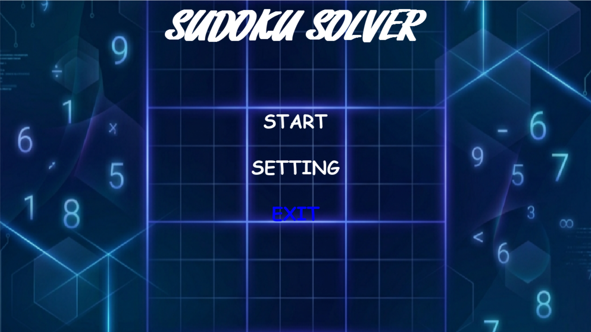
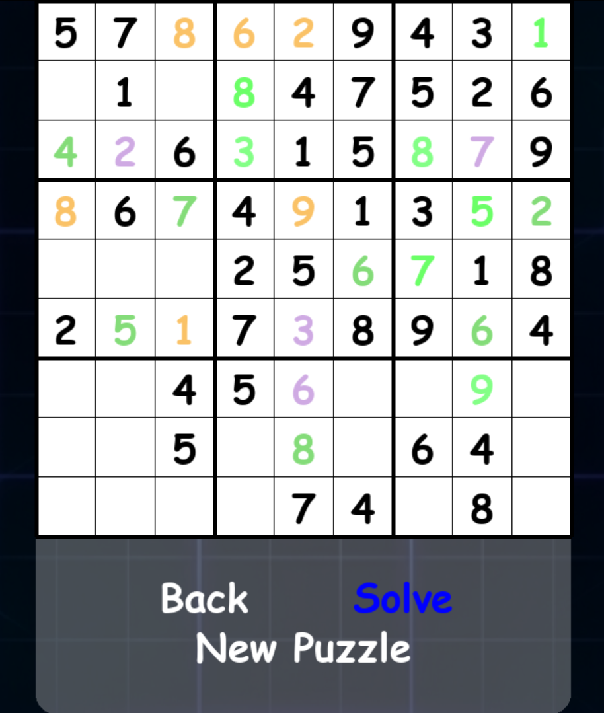

# Intelligent Sudoku Solver: Hybrid CSP & Backtracking

This system moves away from simple brute-force methods to implement an intelligent, hybrid AI approach for solving Sudoku. By combining Constraint Satisfaction Problem (CSP) techniques with optimized Backtracking search, the application solves puzzles of varying complexity with high efficiency. It utilizes deterministic logic to fill cells whenever possible and falls back to a search-based approach only when logical deduction is exhausted.

The backend incorporates **Constraint Propagation** (Naked Singles and Hidden Singles) to significantly reduce the search space. During the search phase, the system employs the **Minimum Remaining Values (MRV)** heuristic to prioritize the most constrained cells, ensuring that wrong paths are identified and pruned early. This mirrors human-like problem-solving while maintaining the computational speed of modern search algorithms.

### Gallery

|              Main Landing Screen             |                Difficulty Selection                |
| :------------------------------------------: | :------------------------------------------------: |
|  |  |

|             Gameplay & Visualization             |
| :----------------------------------------------: |
|  |

### System Functionality

The application uses a modular architecture that separates puzzle logic from the interactive visualization layer:

* **Hybrid Solver Engine**: Executes deterministic CSP logic first, then employs recursive backtracking with MRV heuristics for remaining cells.
* **Unique Puzzle Generation**: Algorithmically generates valid Sudoku grids and ensures every puzzle has exactly one unique solution.
* **Real-time Visualization**: Animates the solving process using color-coding to distinguish between logic-solved (CSP) and search-solved (Backtracking) cells.
* **Difficulty Scaling**: Supports three distinct levels—Easy, Medium, and Hard—by varying the number of initial clues provided.

### Project Structure

```text
.
├── Bg.png               # Landing screen background asset
├── Bg1.png              # Secondary background asset
├── setting.png          # UI settings icon
├── sudoku_core.py       # Core AI logic (CSP, Backtracking, MRV)
├── themed gui.py        # Pygame-based User Interface and Animation
└── Screenshots/         # Folder containing UI documentation images
```

### Setup and Installation

This project requires Python 3.10+ and the Pygame library for the graphical interface.

#### Clone the repository

```bash
git clone https://github.com/yourusername/sudoku-solver-ai.git
cd sudoku-solver-ai
```

#### Install the necessary Python libraries

```bash
pip install pygame
```

#### Launch the application

```bash
python "themed gui.py"
```

### Technologies and References

The development of this system was supported by core AI principles and specialized libraries:

Python: The primary programming language used for engine and GUI development.
Pygame: Used for building the interactive grid, handling user input, and managing real-time animations.
Constraint Satisfaction (CSP): The theoretical framework used to model Sudoku constraints (Row, Column, and Box uniqueness).
Minimum Remaining Values (MRV): An optimization heuristic used to speed up the backtracking search by choosing the most restricted variables first.
